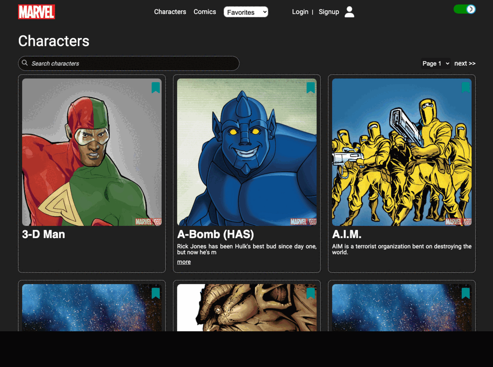

# MARVEL - Frontend

MARVEL app is a fully responsive and simplified version of a Marvel like website. The backend API for the app can be found here : https://github.com/btboubacar/marvel-backend.

## Features:

1. Listing characters and comics with the possibility to have more details about them.
2. Clicking on any character or comic for more details
3. A character or comic can be searched by its title/name. The website also supports **pagination** (It's possible to jump to any page).
4. **Auto-completion** is implemented for character or comic search
5. Implemented selection of **favorite characters and comics** by logged in users. The favorite characters and comics are saved in a mongoDB database.
6. Possibility to delete favorites
7. Clicking on characters or comics under favorites to list the selected favorites
8. Possibility to **sign in** or **signup**. During signup, a user can upload an avatar or a profile image.
9. Possibility to navigate in **light** or **dark** mode.
10. The website is **fully responsive** !

## Screens captures

<div>

</div>

## Installation

get the repository

```bash
$ git clone https://github.com/btboubacar/marvel-frontend
```

enter the directory

```bash
$ cd marvel-frontend
```

install the dependencies

```bash
$ yarn
```
